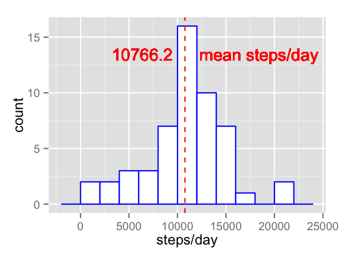
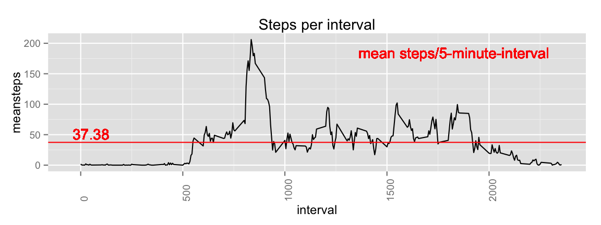
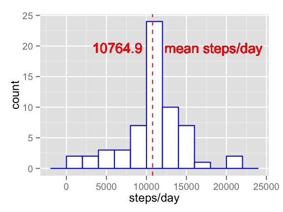
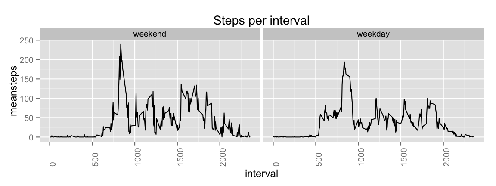

##Loading and processing the data

1. First, we download the zip and we unzip it:

```r
if(!file.exists("repdata-data-activity.zip")) {
        temp <- tempfile()
        download.file("http://d396qusza40orc.cloudfront.net/repdata%2Fdata%2Factivity.zip",temp)
        file <- unzip(temp)
        unlink(temp)
}
```
2. Then, we load it into a data frame and transform it:

```r
dataSet <-read.table(file, sep=",", header=T, quote="\"")
dataSet$date <- as.Date(dataSet$date)
dataSet$steps <- as.numeric(dataSet$steps) 
```

##What is mean total number of steps taken per day?
First, we aggregate a data frame containing the sum of steps per day, which is `dataSet.steps`:

```r
dataSet.steps <- aggregate(dataSet$steps, list(date = dataSet$date), sum)
names(dataSet.steps) <- c("date", "steps")
```
1. Calculate the total number of steps taken per day.

We show this aggregated data frame:

```r
head(dataSet.steps)
```

```
##         date steps
## 1 2012-10-01    NA
## 2 2012-10-02   126
## 3 2012-10-03 11352
## 4 2012-10-04 12116
## 5 2012-10-05 13294
## 6 2012-10-06 15420
```
2. Make a histogram of the total number of steps taken each day


```r
dataSet.steps <- dataSet.steps[complete.cases(dataSet.steps), ]
dataSet.steps$steps <- as.numeric(dataSet.steps$steps)
m <- data.frame(value=mean(dataSet.steps$steps), text="mean steps/day")
library(ggplot2)
g <- ggplot(dataSet.steps, aes(x=steps)) +
        geom_histogram(binwidth=2000, fill="white", colour="blue")
```

We call ggplot:

```r
g + geom_vline(aes(xintercept=m$value), colour="red", linetype="dashed",
        show_guide=TRUE) +
        geom_text(aes(x=m$value, label="mean steps/day", y=1), colour="red",
        angle=0, vjust=-11, hjust=-.12, text=element_text(size=1)) +
        geom_text(aes(x=m$value, label=round(m$value, digits=1), y=1), colour="red",
 angle=0, vjust=-11, hjust=1.2, text=element_text(size=1)) +
        xlab("steps/day")
```

 

3. These are the values we obtain for the mean and median of the total number of steps taken per day:

```r
meansteps <- m$value
meansteps
```

```
## [1] 10766.19
```

```r
mediansteps <- median(dataSet.steps$steps)
mediansteps
```

```
## [1] 10765
```

##What is the average daily activity pattern?
1. Make a time series plot of the 5-minute interval and the average number of steps taken, averaged across all days.


```r
library(plyr)
dataSetClean <- na.omit(dataSet)
dataSetPattern <- ddply(dataSetClean, ~interval, summarise, meansteps=mean(steps))
head(dataSetPattern)
```

```
##   interval meansteps
## 1        0 1.7169811
## 2        5 0.3396226
## 3       10 0.1320755
## 4       15 0.1509434
## 5       20 0.0754717
## 6       25 2.0943396
```
Now that we have a clean daily pattern, we can calculate the mean for each interval (please consider this a "plus") so that we can draw a reference line:

```r
intervalMean <- mean(dataSetClean$steps)
intervalMean
```

```
## [1] 37.3826
```
And now, we plot:

```r
g <- ggplot(aes(x = interval, y = meansteps, group=0), data = dataSetPattern)
g + geom_line()+
        ggtitle("Steps per interval")+
        theme(axis.text.x = element_text(angle = 90, hjust = 0))+
        geom_hline(aes(yintercept=mean(dataSetClean$steps)), color="red")+
        geom_text(aes(x=-40, label="mean steps/5-minute-interval", y=mean(dataSetClean$steps)), colour="red", angle=0, vjust=-8, hjust=-1.5, text=element_text(size=0.3))+
        geom_text(aes(x=-40, label=round(mean(dataSetClean$steps), digits=2), y=mean(dataSetClean$steps)), colour="red", angle=0, vjust=-0.3, hjust=0, text=element_text(size=0.3))
```

 
2. Which 5-minute interval, on average across all the days in the dataset, contains the maximum number of steps?

```r
dataSetPattern[which.max(dataSetPattern$meansteps), ]
```

```
##     interval meansteps
## 104      835  206.1698
```
...which means that 08:35am is the most active 5-minute interval, on average, accross all the days, with the highest interval-mean of 206.17 steps per 5-minute interval.

##Imputing missing values
1. Calculate and report the total number of missing values in the dataset
This can be easily found in the summary of the first data frame (last line, 2304 NAs):

```r
summary(dataSet)
```

```
##      steps             date               interval     
##  Min.   :  0.00   Min.   :2012-10-01   Min.   :   0.0  
##  1st Qu.:  0.00   1st Qu.:2012-10-16   1st Qu.: 588.8  
##  Median :  0.00   Median :2012-10-31   Median :1177.5  
##  Mean   : 37.38   Mean   :2012-10-31   Mean   :1177.5  
##  3rd Qu.: 12.00   3rd Qu.:2012-11-15   3rd Qu.:1766.2  
##  Max.   :806.00   Max.   :2012-11-30   Max.   :2355.0  
##  NA's   :2304
```
2. Devise a strategy for filling in all of the missing values in the dataset.
- *One solution can be choosing dividing the data set into two groups: weekday and weekend. Then, any NA will take its value from the mean of the group they belong!*
Let's divide the clean data set:

```r
dataSetWK <- transform(dataSet, wd = as.factor(ifelse(weekdays(dataSet$date)
        %in% c("Saturday","Sunday"),"weekend", "weekday")))
dataSetWK.Clean <- na.omit(dataSetWK)
```
Then, we apply the same "ddply" transformation as in the previous question to obtain two different pattern where we will look for the typical step mean value (WE=weekend, WD=weekday):

```r
dataSetWE <- dataSetWK.Clean[dataSetWK$wd == 'weekend', ]
dataSetWE.Pattern <- ddply(dataSetWE, ~interval, summarise, meansteps=mean(steps))
dataSetWD <- dataSetWK.Clean[dataSetWK$wd == 'weekday', ]
dataSetWD.Pattern <- ddply(dataSetWD, ~interval, summarise, meansteps=mean(steps))
```
Now, let's exchange the NAs for their correspondent WE/WD pattern:

```r
transf <- dataSetWK[is.na(dataSetWK$step)==TRUE, ]
transf <- transform(transf,steps2 = 1*(transf$wd=='weekday')*dataSetWD.Pattern[dataSetWD.Pattern$interval %in% dataSetWK$interval, 2]+1*(transf$wd=='weekend')*dataSetWE.Pattern[dataSetWE.Pattern$interval %in% dataSetWK$interval, 2] )
myCols<-c("date", "steps2", "interval", "wd")
transf <- transf[myCols]
names(transf) <-c("date", "steps", "interval", "wd")
```
3. Create a new dataset that is equal to the original dataset but with the missing data filled in.

```r
dataSetNew<-rbind(dataSetWK.Clean, transf)
head(dataSetNew)
```

```
##     steps       date interval      wd
## 289     0 2012-10-02        0 weekday
## 290     0 2012-10-02        5 weekday
## 291     0 2012-10-02       10 weekday
## 292     0 2012-10-02       15 weekday
## 293     0 2012-10-02       20 weekday
## 294     0 2012-10-02       25 weekday
```
4. Make a histogram of the total number of steps taken each day and Calculate and report the mean and median total number of steps taken per day.

```r
dataSetNew.steps <- aggregate(dataSetNew$steps, list(date = dataSetNew$date), sum)
names(dataSetNew.steps) <- c("date", "steps")
m2 <- data.frame(value=mean(dataSetNew.steps$steps), text="mean steps/day")
library(ggplot2)
g <- ggplot(dataSetNew.steps, aes(x=steps)) +
        geom_histogram(binwidth=2000, fill="white", colour="blue")
```

We call ggplot:

```r
g + geom_vline(aes(xintercept=m2$value), colour="red", linetype="dashed",
        show_guide=TRUE) +
        geom_text(aes(x=m2$value, label="mean steps/day", y=1), colour="red",
        angle=0, vjust=-11, hjust=-.12, text=element_text(size=1)) +
        geom_text(aes(x=m2$value, label=round(m2$value, digits=1), y=1), colour="red",
 angle=0, vjust=-11, hjust=1.2, text=element_text(size=1)) +
        xlab("steps/day")
```

 
Now we calculate mean and median:

```r
meansteps <- m2$value
meansteps
```

```
## [1] 10764.86
```

```r
mediansteps <- median(dataSetNew.steps$steps)
mediansteps
```

```
## [1] 10576.44
```
`Do these values differ from the estimates from the first part of the assignment?`
Although the mean is almost equal (10764.9 now, Vs. 10766.2 before), the median has decreased quite a bit more (from 10765 to 10576).
`What is the impact of imputing missing data on the estimates of the total daily number of steps?`
It pushes a little down the new median because the NA values were at typical low activity time-patterns.

##Are there differences in activity patterns between weekdays and weekends?
1. Create a new factor variable in the dataset with two levels

```r
dataSetWD.Pattern <- transform(dataSetWD.Pattern, wd="weekday")
dataSetWE.Pattern <- transform(dataSetWE.Pattern, wd="weekend")
dataSetWK.Pattern <- rbind(dataSetWE.Pattern, dataSetWD.Pattern) 
head(dataSetWK.Pattern[dataSetWK.Pattern$wd %in% "weekday", ])
```

```
##     interval meansteps      wd
## 290        0 2.0769231 weekday
## 291        5 0.4615385 weekday
## 292       10 0.1794872 weekday
## 293       15 0.2051282 weekday
## 294       20 0.0000000 weekday
## 295       25 1.6153846 weekday
```

```r
head(dataSetWK.Pattern[dataSetWK.Pattern$wd %in% "weekend", ])
```

```
##   interval meansteps      wd
## 1        0 0.7142857 weekend
## 2        5 0.0000000 weekend
## 3       10 0.0000000 weekend
## 4       15 0.0000000 weekend
## 5       20 0.2857143 weekend
## 6       25 3.4285714 weekend
```
2. Make a panel plot containing a time series plot


```r
g <- ggplot(dataSetWK.Pattern, aes(x = interval, y = meansteps, group=wd))
g + geom_line()+
        ggtitle("Steps per interval")+
        theme(axis.text.x = element_text(angle = 90, hjust = 0))+
        facet_wrap( ~ wd)
```

 
